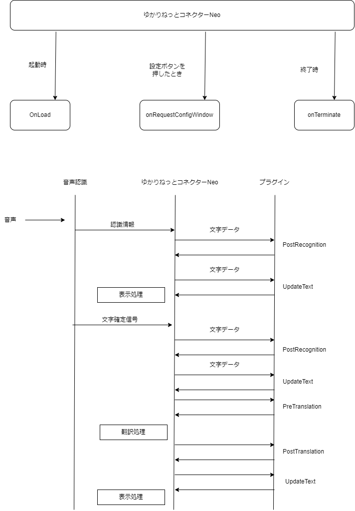

# YNCNeo_Plugin
ゆかりねっとコネクターNeoプラグイン開発キット

## これは何をするものですか？
* 多言語字幕翻訳ツール「[ゆかりねっとコネクターNeo](https://www.machanbazaar.com/ync-neo/)」のプラグイン開発キットです。
* 音声に応じ、配信プラットフォーム、xRツール、ハードウェアと連動させることを狙いとしています。

## 作成に必要な環境
* Windows 
* Microsoft Visual Studio 2019 相当
* .Net Framework 4.8
* C#

## 最低限必要なライブラリ
* Newtonsoft.Json(nuget復元で導入されます)

## プラグインの作り方
1. プラグインファイルをVisualStudioで読み込んでください。

2. nugetパッケージの復元を用いてライブラリ攻勢を復元します。

3. プラグインの名前をきめてください。
	* Plugin_IDにGUID形式でぶつからないIDをきめます。ぶつかった場合はプラグインが正常に読み込まれません。
	* Plugin_Nameに名前をいれます。
	* Plugin_Tagに識別タグをいれます。設定保存にこの名前が使われます。プラグインを自作する場合は　「Plugin_作者識別ニックネーム_ツール識別名」をベースに命名してください
	* 
4.  処理を書き込みます。
	* 処理フローは下記の通りです。

5.コンパイルしてください。dllファイルが生成されます。

6.ゆかりねっとコネクターNeoがインストールされているフォルダにPluginフォルダがあるので、その中に自分のプラグイン用のフォルダを作り、手順4で生成したファイルを入れてください。
* 配布するときは、この段階でWindowsのセキュリティによりブロックされることがあるため、インストーラを用意することを推奨します。

7.ゆかりねっとコネクターNeoを起動します。正しく認知されていれば、プラグインリストに名前が表示されます。

# 免責事項
* ゆかりねっとコネクターNeoは開発が続いており、予告なく仕様が変わる可能性があります。
* ゆかりねっとコネクター v2.0.50以降の場合は、 2023/1/7公開版以上に対応しています。
* 説明していないパラメータが関数内に渡される事がありますが、将来もアクセスできるかどうかについて保証はありません。
* 戻り値に不正な値を渡さないように注意してください。場合によっては他のプラグインやゆかりねっとコネクターNeoが不正な動作をしたり、異常終了する原因となります。
* 内部構成の作りがあまりイケてない部分はありますが、数年前からの過去のアーキテクチャを引きずった結果です。ゆかりねっとコネクターNEO自体の構造変更のタイミングで見直す時期が来るとおもいます。

# 禁止事項
* 本プラグインが扱うデータを使って機械学習やデータ転用をすることを原則禁止します。とくに、音声認識や翻訳に関しては、各プラットフォーマ利用契約上の問題があるため禁止です。
* これらのプラグイン機能によってプライバシーに関する配慮が必要な情報に触れる可能性があります。ユーザの意思によらない形で情報の収集や転用をすることを禁止します。
* 各プラットフォームやゆかりねっとコネクターNeoの運用に損害や支障をあたえるようなプラグインを製作しないでください。

# そのほか
* 内部で使えるインタフェイスはいくつか用意されています。

        //プラグインアイコン(nameには Plugin_Tagを指定する)
        public  void RegistIcon(string name, byte[] bitmap);

        //内部設定の取得
        public  string GetSettingParam(string name);

        //内部設定の保存
        public  void SetSettingParam(string name, string value);

        //文章の送信 (ユニークな文章ID、文章、文が確定しているかどうか？）
        public  void SendTextdata(string ID, string text, bool isFixed);

        //デバッグログ出力
        public  void WriteLog(string message);

        //翻訳の実行　(戻り値の["text"]に翻訳結果が入る)
        public  Dictionary<string, object> getTranslate(string lang, string _Text)

        //内部設定の取得（リスト）
        public  string GetSettingParamList(string name, string key);

        //内部設定の削除（リスト）
        public  void RemoveSettingParamList(string name, string key);

        //内部設定の存在確認（リスト）
        public  bool GetContainsParamList(string name, string key);

        //内部設定の設定（リスト。Senderには Plugin_Tagを指定する）
        public  void SetSettingParamList(string name, string key, string value, string Sender);

		//読み上げAPIでこのプラグインを有効にしたい場合
		public void enabledFunctionOnSpeech();

		//読み上げAPIでこのプラグインを無効にしたい場合
		public void disabledFunctionOnSpeech();

		//翻訳サーバでこのプラグインを有効にしたい場合
		public void enabledFunctionOnTranslateServer();

		//翻訳サーバでこのプラグインを無効にしたい場合
		public void disabledFunctionOnTranslateServer();
